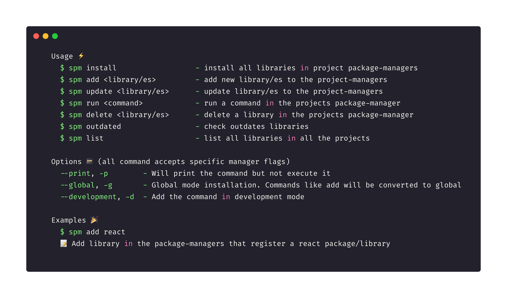

# SPM (SinglePackage Manager)

The only package manager to rule them all 💍

- Resolve conflicts with shared libraries in a interactive cli 🤷🏻‍♂️
- General commands: forget about the implementation of each package manager
- Accept flags from each command
- Support npm, yarn, pnpm, bundler, cargo, composer

# Installation

`yard global add @omarsotillo/spm`

# Usage (--help)

## Package managers supported

|        Package manager        | Install | Add | Update | Lock | Global | Development(soon) |
| :---------------------------: | :-----: | :-: | :----: | :--: | :----: | :---------------: |
|           yarn(js)            |   ✅    | ✅  |   ✅   |  ✅  |   ✅   |        ❌         |
|            npm(js)            |   ✅    | ✅  |   ✅   |  ✅  |   ✅   |        ❌         |
|           pnpm(js)            |   ✅    | ✅  |   ✅   |  ✅  |   ✅   |        ❌         |
|         bundler(ruby)         |   ✅    | ✅  |   ✅   |  ✅  |   ✅   |        ❌         |
| cargo - with cargo-edit(rust) |   ❌    | ❌  |   ❌   |  ❌  |   ❌   |        ❌         |
|          pip(python)          |   ❌    | ❌  |   ❌   |  ❌  |   ❌   |        ❌         |
|         composer(php)         |   ✅    | ✅  |   ✅   |  ✅  |   ✅   |        ❌         |

## Contributing

TODO: contributing guide
`yarn install`
`yarn run start`
`ts-node dist/index.js <command> <options>`
