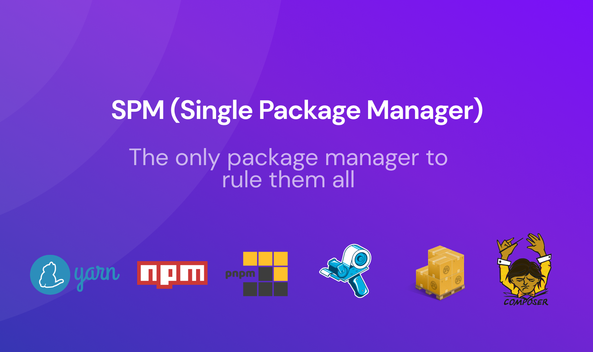

[](https://david-dm.org/omarsotillo/spm)
[](https://david-dm.org/omarsotillo/omar#info=devDependencies)
[](https://www.npmjs.org/package/omarsotillo/spm)

<!-- [](https://coveralls.io/github/omarsotillo/spm) -->

- Resolve conflicts with shared libraries in a interactive cli
- General commands: forget about the implementation of each package manager
- Accept flags from each command
- Support npm, yarn, pnpm, bundler, cargo, composer

# Installation

`yarn global add @omarsotillo/spm`

# Usage (--help)

```bash
    Usage ⚡️
      $ spm install                  - install all libraries in project package-managers
      $ spm add <library/es>         - add new library/es to the project-managers
      $ spm update <library/es>      - update library/es to the project-managers
      $ spm run <command>            - run a command in the projects package-manager
      $ spm delete <library/es>      - delete a library in the projects package-manager
      $ spm outdated                 - check outdates libraries
      $ spm list                     - list all libraries in all the projects

    Options 🗃 (all command accepts specific manager flags)
      --print, -p        - Will print the command but not execute it
      --global, -g       - Global mode installation. Commands like add will be converted to global
      --dev, -d  - Add the command in development mode
      --backend, -b      - Run command in backend package manager only
      --frontend, -f     - Run command in frontend package manager only

    Examples 🎉
      $ spm add react
      📝 Add library in the package-managers that register a react package/library
```

# Package managers supported

|     Package manager      | Install | Add | Update | Global | Dev() | Delete |
| :----------------------: | :-----: | :-: | :----: | :----: | :---: | :----: |
|         yarn(js)         |   ✅    | ✅  |   ✅   |   ✅   |  ✅   |   ✅   |
|         npm(js)          |   ✅    | ✅  |   ✅   |   ✅   |  ✅   |   ✅   |
|         pnpm(js)         |   ✅    | ✅  |   ✅   |   ✅   |  ✅   |   ✅   |
|      bundler(ruby)       |   ✅    | ✅  |   ✅   |   ✅   |  ✅   |   ✅   |
| cargo - cargo-edit(rust) |   ✅    | ✅  |   ✅   |   ✅   |  ✅   |   ✅   |
|       pip(python)        |   ❌    | ❌  |   ❌   |   ❌   |  ❌   |   ❌   |
|      composer(php)       |   ✅    | ✅  |   ✅   |   ✅   |  ✅   |   ✅   |

# Contributing
You need (ts-node)[https://github.com/TypeStrong/ts-node]. Please, follow the instructions

```bash
yarn install
yarn run start
ts-node dist/index.js <command> <options> // e.g ts-node dist/index.js add react
```

# Thanks

Heavily inspired
